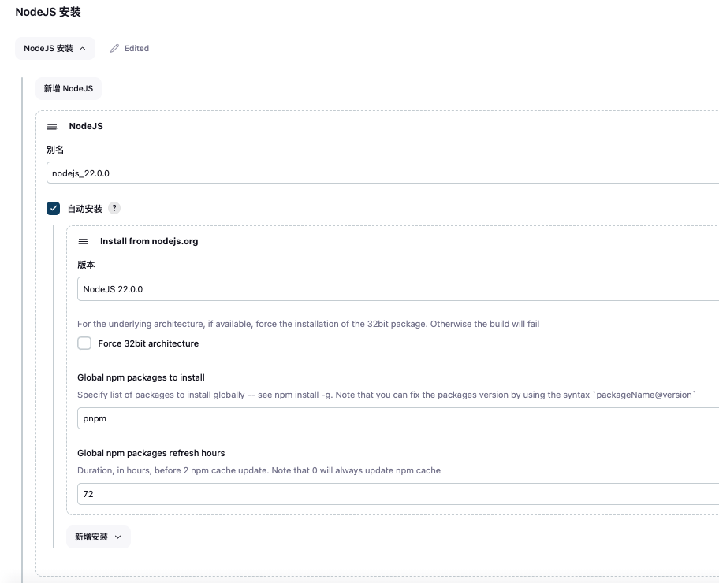
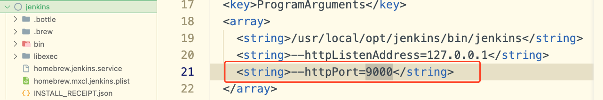

### Jenkins 搭建过程

> 本仓库暂存自定义构建风格的配置文件及 pipeline 风格配置文件。
> 本项目以 mac 安转及启动服务为例

##### 1. 安装 jenkins 包

```zsh
  // 安装等待时间比较长
  brew install jenkins
```

##### 2. 启动 jenkins

```zsh
  // 默认端口是 8080，修改方法见下方介绍
  // 此时可以打开浏览器 http://localhost:8080/ 访问 jenkins 服务
  // 初次打开用户 admin，密码根据提示复制即可，可以修改密码
  brew services start jenkins
```

##### 3. 常见的 jenkins 服务命令
``` zsh
   // Restart the Jenkins service
   brew services restart jenkins

   // Update the Jenkins version
   brew upgrade jenkins

   // Stop the Jenkins service
   brew services stop jenkins
```

#### 一些配置以及配置修改步骤等

1. 插件安装 （系统管理 > 插件管理）
   可以安装项目需要的额外插件，比如 nodejs 等；
2. 插件配置 （系统管理 > 全局工具配置）
   <p style="color: green;">🌰 NodeJs 配置</p>

   

   1. 可以选择安转的 node 版本；
   2. 可以指定要全局安装的软件包列表；

3. jenkins 服务重启 （系统管理 > 读取设置）
   <p style="font-size: 12px; color: red;">通过修改本地配置文件，修改后一定要执行重启 jenkins，否则不生效！！！</p>

4. 生成文件地址：/Users/用户/.jenkins/workspace

5. mac jenkins 默认安装路径 /Users/用户/.jenkins
6. mac jenkins 默认环境配置路径 /usr/local/opt/jenkins (是 usr 不是 user！！！)
7. 修改默认 jenkins 端口号，文件地址 /usr/local/opt/jenkins/homebrew.mxcl.jenkins.plist
   

##### 参考文档：

1. https://www.jenkins.io/zh/doc/pipeline/tour/getting-started/
2. https://www.cnblogs.com/tkliu/p/14601586.html
3. https://www.cnblogs.com/hiyong/p/15890284.html
4. https://wiki.eryajf.net/pages/2415.html#_1-系列文章
